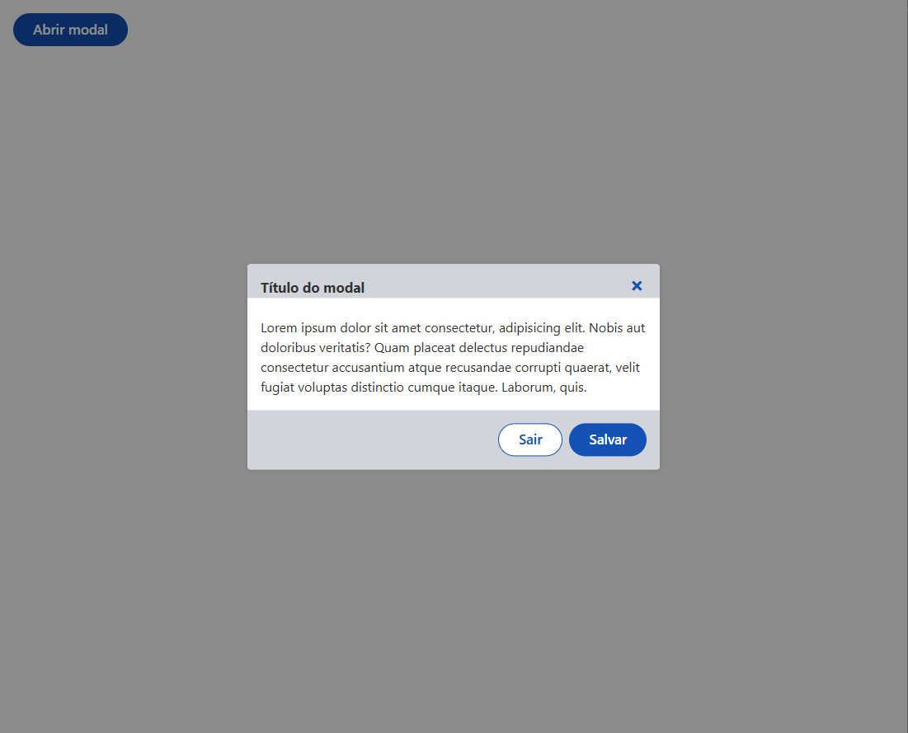

# Govbr React Components

Biblioteca de componentes desenvolvida com as especificações do Design System Govbr.

## Objetivo

Seu principal objetivo é priorizar a flexibilidade e oferecer suporte completo a SSR (Server-Side Rendering), uma feature que está sendo amplamente utilizada nos projetos React atuais. Criada com o objetivo de proporcionar uma experiência de desenvolvimento ágil, ela permite a criação de interfaces de usuário altamente customizáveis, seguindo ainda os padrões do Design Sistem do Govbr.

### Características principais

Flexibilidade total de layout e estilo: A biblioteca oferece uma vasta gama de componentes reutilizáveis como botões, inputs, modais, tabelas, entre outros, que podem ser facilmente personalizados através de props, temas, ou até mesmo por classes CSS. Ela permite que os desenvolvedores ajustem os componentes às necessidades específicas do projeto sem se preocupar com rigidez de design.

Suporte completo a SSR (Server-Side Rendering): A biblioteca foi projetada desde o início para ser compatível com SSR. Isso significa que ela pode ser usada de forma eficiente em projetos que exigem renderização no servidor, como em aplicações Next.js ou qualquer outra solução que necessite de geração de páginas no lado do servidor para otimizar o desempenho e SEO.

Arquitetura modular e leve: Cada componente pode ser importado de forma isolada, garantindo que apenas o necessário seja carregado. Isso resulta em pacotes menores e uma performance melhorada.

Não necessita da importação do core.css do govbr: Ao importar o core.css do DSGovbr em um projeto React, pode comprometer a stack de utilização de estilos do desenvolvedor, tais como Tailwind.css, o qual é muito utilizado em conjunto com NextJs.

Acessibilidade e boas práticas: Todos os componentes são construídos seguindo as práticas de acessibilidade do DSGovbr.

## 🚀 Instalação

1. Instalar a biblioteca de componentes:

```sh
npm install @helder-nicollas/govbr-react-components
```

2. Instalar a biblioteca de ícones do Font Awesome Free na versão 5.x:

```sh
npm install @fortawesome/fontawesome-free@^5.11.2
```

3. Importar em seu projeto os arquivos essenciais para estilização dos componentes:

```js
/* main.tsx */
import '@fortawesome/fontawesome-free/css/all.min.css';
import '@helder-nicollas/govbr-react-components/styles/globals.css';
```

4. Importar as fontes _Raleway_ e _Rawline_ no projeto através do arquivo <code>index.html</code>.

Exemplo:

```html
<!-- index.html -->
<html>
    <head>
        <!-- Raleway-->
        <link
            rel="stylesheet"
            href="https://fonts.googleapis.com/css?family=Raleway:300,400,500,600,700,800,900&amp;display=swap"
        />
        <!-- Rawline-->
        <link href="https://fonts.cdnfonts.com/css/rawline" rel="stylesheet" />
    </head>
    <!-- restante do documento -->
</html>
```

## 🔔 Utilização

Exemplo de utilização de um componente:

```tsx
import { Button } from '@helder-nicollas/govbr-react-components/button';

export function Component() {
    return (
        <main>
            <div>
                <Button variant="primary" />
            </div>
        </main>
    );
}
```

## 💡 Utilizando componentes que precisam de hidratação no NextJs

Alguns componentes da biblioteca, por padrão, necessitam de funcionalidades de client components. Para utilizar um componente que necessita de hidratação javascript no **NextJs**, basta envolvê-lo num client component para habilitar as funcionalidades dele. Considere também ver a documentação oficial do [NextJs](https://nextjs.org/docs/app) e entender um pouco mais sobre o funcionamento de hidratação parcial ([Server](https://nextjs.org/docs/app/building-your-application/rendering/server-components) e [Client](https://nextjs.org/docs/app/building-your-application/rendering/client-components) components).

Exemplo utilizando um client component no NextJs:

```tsx
'use client';
import { Select } from '@helder-nicollas/govbr-react-components/select
import { SelectTrigger } from '@helder-nicollas/govbr-react-components/select-trigger

export function Form() {
    const array = [
        {
            label: 'Maçã',
            value: '1',
        },
        {
            label: 'Pera',
            value: '2',
        },
        {
            label: 'Banana',
            value: '3',
        },
    ];
    const onChangeValue = () => {};
    return (
        <Select onChangeValue={onChangeValue}>
            <SelectTrigger>
                <SelectTrigger.Field />
            </SelectTrigger>
            <Select.List>
                {array.map((item, index) => (
                    <Select.Item
                        index={index}
                        value={item.value}
                        key={item.value}
                    >
                        {item.label}
                    </Select.Item>
                ))}
            </Select.List>
        </Select>
    );
}
```

## ⚡ Flexibilidade

Um exemplo claro de flexibilidade é a utilização de componentes compostos para gerar a UI, onde cada componente pode ser customizado de acordo à necessidade do desenvolvedor, tanto na parte de interações do usuário, quanto na parte de estilização. Abaixo está o exemplo de um corpo de componente utilizando [TailwindCSS](https://tailwindcss.com/):

```tsx
const [open, setOpen] = useState(false);
return (
    <>
        <Button onClick={() => setOpen(true)}>Abrir modal</Button>
        <Modal open={open} onOpenChange={() => setOpen(false)}>
            <Modal.Content className="rounded">
                <Modal.Header withCloseButton className="bg-gray-300">
                    <Modal.Title>Título do modal</Modal.Title>
                </Modal.Header>
                <Modal.Body>
                    <p>
                        Lorem ipsum dolor sit amet consectetur, adipisicing
                        elit. Nobis aut doloribus veritatis? Quam placeat
                        delectus repudiandae consectetur accusantium atque
                        recusandae corrupti quaerat, velit fugiat voluptas
                        distinctio cumque itaque. Laborum, quis.
                    </p>
                </Modal.Body>
                <Modal.Footer className="bg-gray-300">
                    <Button variant="outline">Sair</Button>
                    <Button>Salvar</Button>
                </Modal.Footer>
            </Modal.Content>
        </Modal>
    </>
);
```
### Resultado:



**Nota**: Todos os padrões de acessibilidade e as funcionalidades que o **core** do govbr oferece continuam sendo utilizados nos componentes.


## 📝 Componentes que necessitam de hidratação javascript
Alguns componentes devem ser utilizados obrigatoriamente como **client components**, pois o javascript se torna essencial para seu funcionamento. São eles:
1. Select
2. Modal
3. MultiSelect
4. Menu
5. Dropdown
6. Header


## ⚙️ Tecnologias

Esta bilioteca de componentes está sendo desenvolvida utilizando:

1. React
2. Jest e React Testing Library
3. Typescript
4. Tailwind CSS
5. Storybook
6. Vite

## 📚 Documentação

Toda a documentação dos componentes pode ser visualizada através do [Storybook do projeto](https://helder-nicollas.github.io/govbr-react-components/).

**Nota: Este manual ainda está em construção.**
